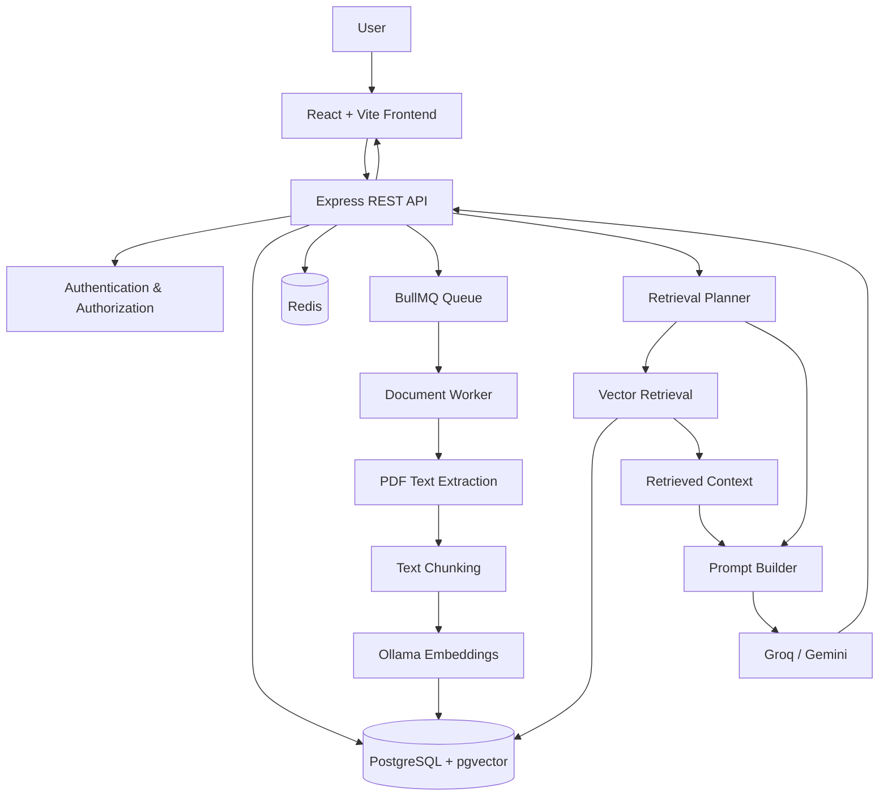

# RecallAI

> **An AI-powered document intelligence platform that lets users ask natural-language questions about their knowledge base and receive context-aware answers grounded in their documents.**

RecallAI is a full-stack **Retrieval-Augmented Generation (RAG)** application built to solve a practical information-retrieval problem: finding useful information inside a growing collection of documents without manually searching through every file.

It combines **semantic vector search, document processing, background jobs, LLM-based retrieval planning, summarization, authentication, and persistent conversations** into one application.

---

## Table of Contents

- [Why RecallAI?](#-why-recallai)
- [Key Features](#-key-features)
- [Architecture](#-architecture)
- [How It Works](#-how-it-works)
- [RAG Strategy](#-rag-strategy)
- [Tech Stack](#-tech-stack)
- [Project Structure](#-project-structure)
- [Getting Started](#-getting-started)
- [Environment Variables](#-environment-variables)
- [API Overview](#-api-overview)
- [Authentication](#-authentication)
- [Document Processing Pipeline](#-document-processing-pipeline)
- [Database Design](#-database-design)
- [Testing](#-testing)
- [Engineering Decisions](#-engineering-decisions)
- [Current Limitations](#-current-limitations)
- [Production Readiness](#-production-readiness)
- [Roadmap](#-roadmap)
- [Contributing](#-contributing)
- [License](#-license)

---

## 🎯 Why RecallAI?

Traditional document search is often **keyword-driven**. Users need to know the terminology used in a document before they can find the information they need.

RecallAI takes a different approach.

Instead of asking:

> "Which document contains this exact phrase?"

users can ask:

> "How does the application handle authentication?"

RecallAI converts the question into a semantic representation, retrieves relevant content from the knowledge base, and gives that context to an LLM to generate a grounded response.

### The problem

As document collections grow, information becomes increasingly difficult to retrieve efficiently.

RecallAI addresses this by providing:

- **Semantic search** instead of exact keyword matching
- **Natural-language questioning** over uploaded documents
- **Context-aware conversations**
- **Targeted and document-level retrieval strategies**
- **Asynchronous document processing**
- **Persistent knowledge bases and conversations**

---

## ✨ Key Features

### 🔐 Authentication & Security

- User registration and login
- Password hashing with `bcrypt`
- Short-lived JWT access tokens
- Refresh-token rotation
- Refresh-token revocation
- HTTP-only refresh-token cookies
- Protected API routes

### 🗂️ Workspaces & Knowledge Bases

- Create, rename, update, and delete workspaces
- Workspace visibility management
- Knowledge bases within workspaces
- Organize documents and conversations by knowledge base

### 📄 Document Ingestion

- PDF document uploads
- Document processing status tracking
- Asynchronous processing with **Redis + BullMQ**
- PDF text extraction
- Text normalization and chunking
- Local embedding generation through **Ollama**
- Vector storage using **PostgreSQL + pgvector**

### 🧠 RAG & Retrieval

- Semantic vector retrieval
- LLM-assisted retrieval planning
- `TARGETED` retrieval for focused questions
- `WHOLE_SOURCE` retrieval for broad questions
- Configurable retrieval scope
- Conversation history used during generation
- Context-grounded answer generation
- Source-aware responses

### 🤖 AI Provider Support

- **Groq** for answer generation and retrieval planning
- **Groq or Gemini** for document summarization
- **Ollama** for local embedding generation

### 💬 Conversations

- Persistent conversations
- Persistent messages
- Conversation rename/delete
- Recent conversation tracking
- Knowledge-base-aware chat

### 🎨 Frontend

- React 19
- Vite
- React Router
- Tailwind CSS
- Responsive UI
- Loading and error states
- Document processing status polling

---

## 🏗️ Architecture



### Architectural principles

RecallAI separates responsibilities across several layers:

```text
Frontend
    ↓
REST API
    ↓
Controllers / Services
    ↓
Repositories
    ↓
PostgreSQL / Redis
```

Long-running document processing is intentionally moved out of the request-response path:

```text
Upload
  ↓
API
  ↓
BullMQ
  ↓
Redis
  ↓
Worker
  ↓
Extract → Chunk → Embed → Store
```

This prevents expensive document-processing operations from blocking API requests.

---

## 🔄 How It Works

### 1. Document ingestion

```text
PDF Upload
    ↓
Create document record
    ↓
Queue background job
    ↓
Redis / BullMQ
    ↓
Document worker
    ↓
Extract PDF text
    ↓
Normalize text
    ↓
Split into chunks
    ↓
Generate embeddings
    ↓
Store chunks + vectors
    ↓
Document becomes READY
```

### 2. Question answering

```text
User Question
    ↓
Load conversation history
    ↓
Retrieval planner
    ↓
Choose retrieval strategy
    ├── TARGETED
    └── WHOLE_SOURCE
    ↓
Retrieve / summarize relevant content
    ↓
Build grounded prompt
    ↓
LLM generation
    ↓
Persist assistant response
    ↓
Return answer + sources
```

---

## 🧠 RAG Strategy

RecallAI does not use the same retrieval strategy for every question.

### TARGETED Retrieval

Designed for focused questions such as:

> "What authentication mechanism does the application use?"

The system:

1. Generates an embedding for the query.
2. Performs vector similarity search with pgvector.
3. Retrieves the most relevant chunks.
4. Builds a context window from those chunks.
5. Sends the context to the generation model.
6. Stores and returns the resulting answer.

This strategy prioritizes **precision and relevance**.

### WHOLE_SOURCE Retrieval

Designed for broad questions such as:

> "Give me an overview of this document."

For these questions, a small top-K selection may omit important information.

RecallAI instead:

1. Retrieves content from the selected source/scope.
2. Processes the content in batches.
3. Produces intermediate summaries.
4. Combines those summaries.
5. Uses the consolidated context for final generation.

This strategy prioritizes **document-level understanding**.

### Retrieval configuration

The current implementation uses approximately:

| Parameter | Value |
|---|---:|
| Chunk size | 1200 characters |
| Chunk overlap | 100 characters |
| Minimum chunk size | 100 characters |
| Default top-K | 5 |
| Vector dimensions | 384 |

---

## 🛠️ Tech Stack

### Frontend

| Technology | Role |
|---|---|
| React 19 | UI |
| Vite | Build tooling |
| React Router | Client-side routing |
| Tailwind CSS | Styling |
| Axios | HTTP client |
| Oxlint | Linting |

### Backend

| Technology | Role |
|---|---|
| Node.js | Runtime |
| Express 5 | REST API |
| PostgreSQL | Primary database |
| pgvector | Vector storage and similarity search |
| Redis | Queue backend |
| BullMQ | Background job processing |
| JWT | Authentication |
| bcrypt | Password hashing |
| Multer | File uploads |
| pdf-parse | PDF extraction |
| LangChain Text Splitters | Text chunking |

### AI / ML

| Technology | Role |
|---|---|
| Groq | Answer generation and retrieval planning |
| Google Gemini | Optional summarization |
| Ollama | Local embedding generation |

---

## 📁 Project Structure

```text
RecallAI/
├── backend/
│   ├── src/
│   │   ├── clients/              # AI provider clients
│   │   ├── config/               # Configuration
│   │   ├── constants/            # Application constants
│   │   ├── controllers/          # HTTP request handlers
│   │   ├── database/
│   │   │   ├── migrations/       # PostgreSQL migrations
│   │   │   └── connection.js
│   │   ├── errors/               # Error handling
│   │   ├── middleware/           # Authentication and validation
│   │   ├── queues/               # BullMQ configuration
│   │   ├── repositories/         # Data-access layer
│   │   ├── routes/               # REST routes
│   │   ├── services/             # Business logic and RAG pipeline
│   │   ├── utils/                # Shared utilities
│   │   ├── workers/              # Background workers
│   │   ├── app.js                # Express application
│   │   └── server.js             # Server entry point
│   ├── tests/                    # Backend tests
│   ├── .env.example
│   └── package.json
│
├── frontend/
│   ├── src/
│   │   ├── components/            # Reusable UI components
│   │   ├── context/               # React contexts
│   │   ├── layouts/               # Application layouts
│   │   ├── pages/                 # Application pages
│   │   ├── services/              # API services
│   │   ├── utils/                 # Frontend utilities
│   │   ├── App.jsx
│   │   └── main.jsx
│   ├── public/
│   ├── .env.example
│   ├── vite.config.js
│   └── package.json
│
└── README.md
```

---

# 🚀 Getting Started

## Prerequisites

Install the following:

- Node.js 20+
- npm
- PostgreSQL
- PostgreSQL `pgvector` extension
- Redis
- Ollama
- A compatible Ollama embedding model
- Groq API key
- Gemini API key if Gemini summarization is enabled

---

## 1. Clone the repository

```bash
git clone <your-repository-url>
cd RecallAI
```

---

## 2. Configure PostgreSQL

Create a database:

```sql
CREATE DATABASE recallai;
```

The migrations enable the PostgreSQL vector extension.

Make sure your PostgreSQL installation supports **pgvector**.

---

## 3. Start Redis

Run Redis locally:

```bash
redis-server
```

Default configuration:

```text
Host: localhost
Port: 6379
```

If Redis uses different settings, update the backend environment variables.

---

## 4. Configure Ollama

Start Ollama:

```bash
ollama serve
```

Pull the embedding model configured by your application:

```bash
ollama pull <your-embedding-model>
```

The default Ollama API endpoint is:

```text
http://localhost:11434/api/embed
```

The embedding model must generate vectors compatible with the database's current `VECTOR(384)` schema.

---

## 5. Configure the backend

```bash
cd backend
npm install
```

Create the environment file.

### macOS / Linux

```bash
cp .env.example .env
```

### Windows PowerShell

```powershell
Copy-Item .env.example .env
```

Configure the required values in `.env`.

---

## 6. Run database migrations

From `backend/`:

```bash
npm run migrate
```

The migrations create the application's core tables and vector support.

---

## 7. Start the backend

Development:

```bash
npm run dev
```

Production-style start:

```bash
npm start
```

The API runs on:

```text
http://localhost:3000
```

---

## 8. Start the document worker

The worker must run separately from the API:

```bash
cd backend
node src/workers/document.worker.js
```

The worker consumes document-processing jobs from Redis/BullMQ.

> **Important:** If the worker is not running, uploaded documents will remain unprocessed.

---

## 9. Start the frontend

Open another terminal:

```bash
cd frontend
npm install
```

Create the environment file:

```bash
cp .env.example .env
```

Set:

```env
VITE_API_BASE_URL=http://localhost:3000
```

Start Vite:

```bash
npm run dev
```

The frontend normally runs at:

```text
http://localhost:5173
```

---

# 🔐 Environment Variables

### Backend

```env
PORT=3000
NODE_ENV=development

DB_HOST=localhost
DB_PORT=5432
DB_USER=postgres
DB_PASSWORD=your_password
DB_NAME=recallai

JWT_SECRET=replace_with_a_long_random_secret
JWT_EXPIRES_IN=15m

REDIS_HOST=localhost
REDIS_PORT=6379

OLLAMA_HOST=http://localhost:11434
OLLAMA_EMBEDDING_MODEL=your-embedding-model

LLM_PROVIDER=groq
SUMMARIZER_PROVIDER=gemini

GROQ_API_KEY=your_groq_api_key
GROQ_GENERATION_MODEL=your_generation_model
GROQ_SUMMARIZER_MODEL=your_summarizer_model
GROQ_PLANNER_MODEL=your_planner_model

GEMINI_API_KEY=your_gemini_api_key
GEMINI_SUMMARIZER_MODEL=your_gemini_summarizer_model
```

### Frontend

```env
VITE_API_BASE_URL=http://localhost:3000
```

> **Never commit `.env` files or API keys to source control.**

---

# 🔌 API Overview

RecallAI exposes a REST API organized around the application's main resources.

### Authentication

```http
POST /auth/register
POST /auth/login
POST /auth/logout
POST /auth/refresh
```

### Workspaces

```http
POST   /workspaces
GET    /workspaces
GET    /workspaces/:id
PATCH  /workspaces/:id
DELETE /workspaces/:id
```

### Knowledge Bases

```http
POST   /workspaces/:workspaceId/knowledge-bases
GET    /workspaces/:workspaceId/knowledge-bases
GET    /knowledge-bases/:knowledgeBaseId
PATCH  /knowledge-bases/:knowledgeBaseId
DELETE /knowledge-bases/:knowledgeBaseId
```

### Documents

```http
POST   /knowledge-bases/:knowledgeBaseId/conversations/:conversationId/documents
GET    /knowledge-bases/:knowledgeBaseId/documents
GET    /knowledge-bases/:knowledgeBaseId/documents/:documentId
GET    /knowledge-bases/:knowledgeBaseId/documents/:documentId/download
PATCH  /knowledge-bases/:knowledgeBaseId/documents/:documentId
DELETE /knowledge-bases/:knowledgeBaseId/documents/:documentId
```

### Conversations

```http
POST   /knowledge-bases/:knowledgeBaseId/conversations
GET    /knowledge-bases/:knowledgeBaseId/conversations
GET    /knowledge-bases/:knowledgeBaseId/conversations/:conversationId
PATCH  /knowledge-bases/:knowledgeBaseId/conversations/:conversationId
DELETE /knowledge-bases/:knowledgeBaseId/conversations/:conversationId
```

### Messages

```http
POST /knowledge-bases/:knowledgeBaseId/conversations/:conversationId/messages
GET  /knowledge-bases/:knowledgeBaseId/conversations/:conversationId/messages
```

Most application routes require authentication.

---

# 🔒 Authentication Flow

RecallAI uses short-lived access tokens together with refresh tokens.

```text
Login
  ↓
Verify credentials
  ↓
Issue access token
  ↓
Create refresh token
  ↓
Store hashed refresh token
  ↓
Set HTTP-only refresh-token cookie
  ↓
Frontend uses access token for API requests
```

When an access token expires:

```text
API Request
    ↓
401 Unauthorized
    ↓
POST /auth/refresh
    ↓
Validate refresh token
    ↓
Revoke previous refresh token
    ↓
Issue new token pair
    ↓
Retry original request
```

This approach limits the lifetime of access tokens while keeping refresh tokens inaccessible to client-side JavaScript.

---

# 📄 Document Processing Pipeline

A document moves through processing states:

```text
UPLOADED
   ↓
QUEUED
   ↓
PROCESSING
   ↓
READY
```

If processing fails:

```text
PROCESSING
   ↓
FAILED
```

The processing pipeline is:

```text
PDF
 ↓
Text Extraction
 ↓
Text Normalization
 ↓
Recursive Character Splitting
 ↓
Chunk Filtering
 ↓
Embedding Generation
 ↓
PostgreSQL + pgvector
```

This processing is performed asynchronously by the document worker.

---

# 🗃️ Database Design

The core domain model is:

```text
User
 └── Workspaces
      └── Knowledge Bases
           ├── Documents
           │    └── Document Chunks
           │         └── Embedding Vector
           │
           └── Conversations
                ├── Messages
                └── Documents
```

### Core tables

- `users`
- `workspaces`
- `knowledge_bases`
- `documents`
- `document_chunks`
- `conversations`
- `messages`
- `refresh_tokens`

Document embeddings are stored using PostgreSQL's `vector` type.

---

# 🧪 Testing

The backend includes focused tests for areas such as:

- Chunking
- Embeddings
- Gemini integration
- Gemini batching
- Multi-document summarization
- Oversized document handling
- Prompt construction
- Retrieval planning
- Redis/queue behavior
- Relevant chunk retrieval
- Token batching
- Summarization

The current repository does not expose a single unified `npm test` command.

For example:

```bash
cd backend
node tests/chunking.test.js
```

Run individual tests according to the requirements of each test file.

---

# 🧹 Development Commands

## Frontend

From `frontend/`:

```bash
npm run dev
npm run build
npm run preview
npm run lint
```

## Backend

From `backend/`:

```bash
npm run dev
npm start
npm run migrate
node src/workers/document.worker.js
```

---

# 🧩 Engineering Decisions

## Why PostgreSQL + pgvector?

RecallAI needs both relational application data and vector search.

PostgreSQL provides the relational layer for:

- Users
- Workspaces
- Knowledge bases
- Documents
- Conversations
- Messages

`pgvector` adds vector similarity search without requiring a separate vector database.

For the current project scale, keeping these capabilities together simplifies the architecture.

---

## Why Redis + BullMQ?

Document extraction and embedding generation can take significantly longer than a normal API request.

Instead of blocking the HTTP request:

```text
API
 ↓
Extract PDF
 ↓
Generate embeddings
 ↓
Store vectors
 ↓
Response
```

RecallAI uses:

```text
API
 ↓
Queue Job
 ↓
Redis
 ↓
Worker
 ↓
Process Document
```

This keeps the API responsive and creates a foundation for retryable background processing.

---

## Why a Retrieval Planner?

Different questions require different amounts of context.

A focused question such as:

> "What database does the application use?"

benefits from targeted retrieval.

A broad question such as:

> "Summarize this document."

may require information distributed across the entire source.

RecallAI therefore separates retrieval into:

```text
TARGETED
    ↓
Precise semantic retrieval

WHOLE_SOURCE
    ↓
Document-level summarization
```

---

## Why Ollama for Embeddings?

Local embeddings reduce dependence on an external embedding API and give the application control over the embedding service.

This can also be useful during development because embedding generation can run locally.

---

# ⚠️ Current Limitations

The current implementation intentionally has several limitations:

- PDF is the currently implemented document format.
- The database schema currently expects `VECTOR(384)` embeddings.
- Uploaded files are stored on the backend filesystem.
- There is no object-storage integration such as Amazon S3.
- Production deployment configuration is not included.
- API documentation is not currently generated from OpenAPI.
- Tests are not exposed through one unified test command.
- Additional source types such as URLs, code, and repositories are future extensions.

---

# 🚀 Production Readiness

Before deploying RecallAI to a public production environment, consider adding:

- HTTPS/TLS
- Secure production cookie configuration
- Strict CORS policies
- API rate limiting
- Structured logging
- Application monitoring
- Centralized error tracking
- Object storage for uploaded documents
- File malware/security scanning
- Stronger upload validation
- OpenAPI/Swagger documentation
- Automated CI/CD
- Database connection-pool tuning
- Redis authentication and TLS
- Queue retry and backoff policies
- Worker health monitoring
- Centralized secrets management
- Comprehensive integration and end-to-end tests

---

# 🗺️ Roadmap

Potential future improvements include:

- [ ] DOCX ingestion
- [ ] TXT / Markdown ingestion
- [ ] HTML and URL ingestion
- [ ] GitHub/repository ingestion
- [ ] Hybrid keyword + vector retrieval
- [ ] Reranking models
- [ ] Answer citations with page/chunk references
- [ ] RAG evaluation metrics
- [ ] Object storage integration
- [ ] OpenAPI documentation
- [ ] Dockerized local development
- [ ] CI/CD pipeline
- [ ] Observability and tracing
- [ ] Advanced workspace permissions
- [ ] Production deployment configuration

---

# 🤝 Contributing

Contributions are welcome.

A typical workflow is:

```bash
git checkout -b feature/your-feature
```

Make your changes, test them locally, and open a pull request with:

- A clear description of the change
- The motivation behind the change
- Testing performed
- Any relevant screenshots or API examples

Please keep changes focused and follow the existing project structure.

---

# 📜 License

Add the project's chosen license here, for example:

```text
MIT License
```

If a license has not yet been selected, replace this section with the appropriate license before publishing the repository.

---

## ⭐ Project Summary

RecallAI demonstrates a production-oriented approach to building an AI document assistant by combining:

```text
React
   +
Node.js / Express
   +
PostgreSQL / pgvector
   +
Redis / BullMQ
   +
Ollama
   +
Groq / Gemini
   +
RAG
```

The project focuses not only on LLM generation, but also on the engineering required around an AI system: **document ingestion, asynchronous processing, vector retrieval, retrieval planning, authentication, persistence, and scalable service boundaries.**
